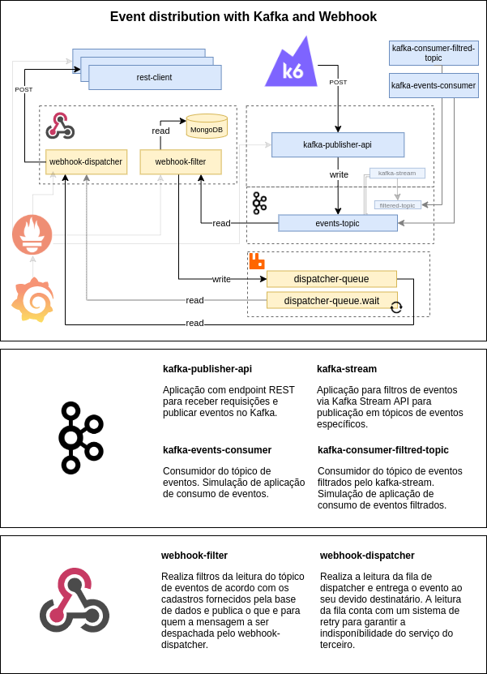

# Distribuição de eventos com Kafka e Webhook

O projeto `events-distribution-platform` tem como intuito validar uma arquitetura que seja capaz de distribuir eventos utilizando o Kafka
como plataforma de Streamming e notificar clientes via Webhooks.

Os webhooks serão cadastrados em uma base NoSQL baseado em filtros de tipo de eventos, assim cada usuário (associado a uma organização) poderia ter diferentes tipos de filtros para notificar diferentes endereços.

# Arquitetura

<p align="center">
    
</p>

## Tecnologias

- [Quarkus](https://quarkus.io) - Framework para construção das aplicações
- [MongoDB](https://www.mongodb.com) - Armazenamento de regras para os filtros do Webhook
- [K6](https://k6.io) - Ferramenta de testes para realizar a chamada na api de carga de eventos.
- [Kafka](https://kafka.apache.org) - Plataforma de Streamming para distribuição de eventos.
- [RabbitMQ]() - Sistema de mensageria para entrega dos eventos na arquitetura do Webhook
- [Prometheus]() - Coletor de métricas das aplicações
- [Grafana]() - Visualizador das métriocas em forma de dashboards


# Execução

O arquivo [docker-compose.yml](./.docker-compose/docker-compose.yml) conta com uma infra toda configurada e customizada com filtro de eventos com o `kafka-stream` um consumidor para o tópico filtrado e um para o tópico geral. Para a arquitetura de Webhook, ao subir a infra do MongoDB já é inicializado pré filtros para realizar a chamada de callback nos três `rest-clients` configurados.

Foi criado um arquivo [Makefile](./Makefile) para auxiliar no processo de execução de todo ambiente.

Executando o build
```sh
>$ make build
```

Construindo imagens docker
```sh
>$ make install
```

Subindo a stack
```sh
>$ make run
```

Executando carga de eventos:
```sh
>$ make send_events
```
# Monitoramento

Temos como monitoramento o Grafana em conjunto com o Prometheus escutando as métricas das aplicações, foi criado uma dashbord default que sobe automaticamente no Grafana ao executar o `make run` (stack do docker-compose).

<p align="center">
    
</p>

Endereços expostos para monitoramento:

- Prometheus: [http://localhost:9090](http://localhost:9090)
- Grafana: [http://localhost:3000](http://localhost:3000)
